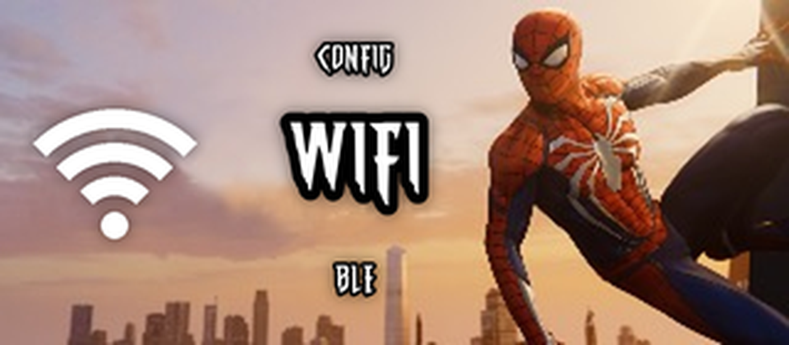
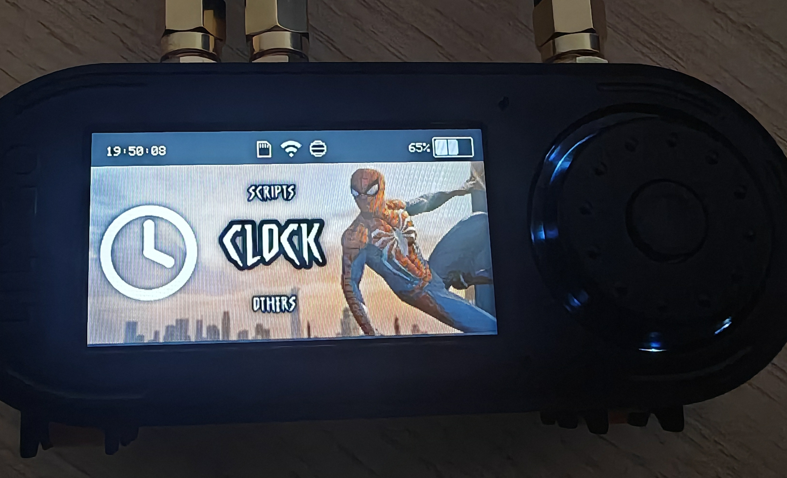
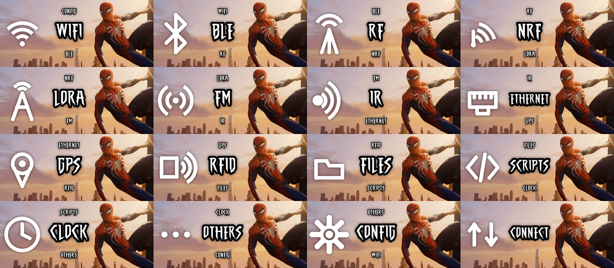
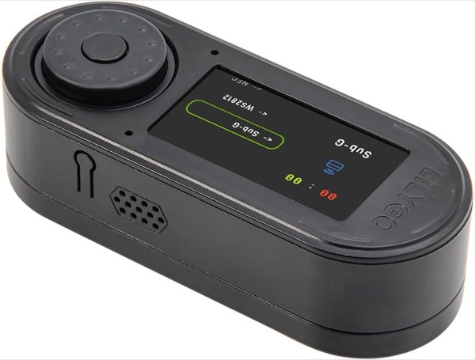

# 🕷️ Spider-Man — Bruce Theme

  

> **EN** — A **Spider-Man** UI theme for the **[Bruce firmware](https://github.com/BruceDevices/firmware)** on the LilyGO T-Embed CC1101 (320×170). Big white picto of the current menu on the left, its name beside it in the classic comic font, with the previous / next menu names above and below — all laid out to the left of Spider-Man.

> **FR** — Un thème UI **Spider-Man** pour le firmware **[Bruce](https://github.com/BruceDevices/firmware)** sur LilyGO T-Embed CC1101 (320×170). Gros picto blanc du menu courant à gauche, son nom à côté dans la typo comic, avec les menus précédent / suivant au-dessus et en dessous — le tout calé à gauche de Spider-Man.

| 🖥️ Sur l'appareil |
|:---:|
|  |

## ✨ Détails

- 🕸️ **Picto courant en grand** à gauche (blanc, trait franc), nom **à côté** dans la police **The Amazing Spider-Man**.
- 🔠 Menus **précédent / suivant** en texte seul (plus petit), au-dessus / en dessous, centrés sur le nom courant.
- 🎯 Mise en page calée pour que même le plus long libellé (**ETHERNET**) tienne sans toucher le picto ni Spider-Man.
- 🔢 Voisins peints selon l'**ordre réel** du menu Bruce T-Embed CC1101 (FM inclus). *Note : la police transforme les chiffres en araignées → « NRF24 » est affiché « NRF ».*

## 📦 Contenu

**4 tailles** × **16 PNG** + `.json` :

| Dossier | Image | Écran cible |
|---|---|---|
| `105px/` | 240×105 | M5StickC Plus (240×135) |
| `140px/` | 320×140 | **T-Embed CC1101 / Cardputer (320×170)** |
| `180px/` | 320×180 | écrans ~320×210 |
| `192px/` | 320×192 | écrans ~320×222 |

> ℹ️ **Barre d'état** — Bruce réserve **30 px en haut**. Taille = hauteur écran − 30 → **T-Embed CC1101 = `140px`**.

## 🚀 Installation

1. Copie le dossier **`Spiderman`** à la racine de la carte SD.
2. Sur l'appareil : **Config → UI Theme → `Spiderman/140px/Theme_Spiderman.json`**.
3. Via WiFi : **Files → WebUI**, upload le dossier, puis sélectionne le `.json`.

## 🛒 Matériel / Hardware

Le matériel utilisé pour ce projet — liens affiliés Amazon :

|  |  |  |
|:---:|:---:|:---:|
| 🔌 **[LilyGO T-Embed CC1101](https://link.amazon/B0cgD7wou)** avec antennes | ⬛ **[LilyGO T-Embed CC1101](https://link.amazon/B071fmsbH)** noir, sans antenne | 📡 **[Kit d'antennes SMA](https://link.amazon/B0eMlSqeZ)** |

En tant que Partenaire Amazon, je réalise un bénéfice sur les achats remplissant les conditions requises. · As an Amazon Associate I earn from qualifying purchases.

## 🎨 Crédits

- Thème par **koua29**. Police de rendu : **The Amazing Spider-Man** (SpideRaYsfoNtS, gratuite pour usage personnel — **non incluse** dans ce dépôt).
- Tourne sur l'excellent **[Bruce firmware](https://github.com/BruceDevices/firmware)**.

## ☕ Un café ?

## 📄 Licence

Assets du dépôt sous **MIT** (voir [LICENSE](LICENSE)). **Spider-Man et Marvel sont des marques de Marvel/Disney** ; projet **fan non officiel**, non affilié, sans but commercial.
